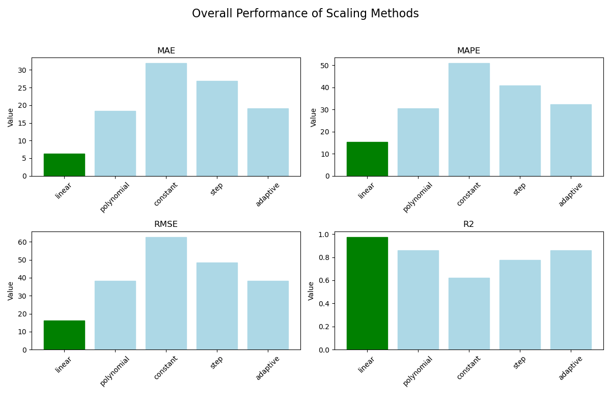

# Food AI Ingredient Scaling: Final Report

## 1. Introduction

This report details the methodologies and evaluation results for the Food AI ingredient scaling assignment. The goal was to develop and assess methods for predicting ingredient quantities for various serving sizes based on a limited set of known data points.

The project implements five distinct scaling algorithms and evaluates them against a comprehensive set of performance metrics. The evaluation follows a rigorous cross-validation procedure to ensure that the results are robust and generalizable.

## 2. Scaling Approaches

Five different approaches were developed to scale ingredient quantities. All methods are designed to take quantities for two known serving sizes and predict for others.

### a. Linear Interpolation (`linear`)

This method assumes a direct, linear relationship between the serving size and the ingredient quantity. It fits a straight line to the two known data points (`y = mx + c`), where `y` is the quantity and `x` is the serving size.

-   **How it works:** It uses `sklearn.linear_model.LinearRegression` to find the slope and intercept that define the line.
-   **Best for:** Ingredients that scale proportionally with the number of servings (e.g., paneer, vegetables, base sauces).

### b. Polynomial Regression (`polynomial`)

This approach models the relationship using a polynomial function (degree 2). This allows for a curved relationship, which can capture non-linear scaling behavior.

-   **How it works:** It uses `sklearn.preprocessing.PolynomialFeatures` combined with `sklearn.linear_model.Ridge` regression to prevent overfitting.
-   **Best for:** Ingredients that might scale more complexly, though it risks overfitting with only two data points.

### c. Constant Scaling (`constant`)

This is the simplest method, assuming the ingredient quantity does not change with the serving size.

-   **How it works:** It calculates the average quantity from the two known data points and uses this constant value for all predictions.
-   **Best for:** Ingredients that are used in fixed amounts, regardless of serving size (e.g., a pinch of a specific spice, a single bay leaf).

### d. Step Scaling (`step`)

This method assumes that quantities change in discrete steps rather than continuously. It predicts the quantity of the nearest known serving size.

-   **How it works:** It uses a nearest-neighbor approach. For a target serving size, it finds the closest training serving size and adopts its quantity.
-   **Best for:** Ingredients that are added in whole units (e.g., one egg, a packet of yeast).

### e. Adaptive Scaling (`adaptive`)

This is a meta-algorithm that automatically selects the best method (`linear`, `polynomial`, or `constant`) for a given ingredient based on the data.

-   **How it works:** It performs a simple leave-one-out cross-validation on the training data to determine which of the base methods has the lowest error for that specific ingredient. It then uses the winning method for prediction.
-   **Best for:** General-purpose scaling where the behavior of an ingredient is not known beforehand.

## 3. Evaluation Metrics

To measure the performance of the scaling methods, a suite of six metrics was chosen to provide a holistic view of the prediction accuracy.

-   **Mean Absolute Error (MAE):** The average absolute difference between predicted and actual quantities. It's easy to interpret and gives a clear sense of the average error in grams.
-   **Mean Absolute Percentage Error (MAPE):** The average percentage error. It is useful for understanding the relative error, independent of the ingredient's quantity scale.
-   **Root Mean Squared Error (RMSE):** Similar to MAE but penalizes larger errors more heavily. It is sensitive to outliers.
-   **R-squared (R²):** Indicates the proportion of the variance in the actual data that is predictable from the model. A value of 1.0 indicates a perfect fit.
-   **Median Absolute Error (Median AE):** The median of all absolute errors. It is robust to outliers and shows the typical error.
-   **Maximum Absolute Error (Max AE):** The single worst prediction error. It is useful for understanding the worst-case performance.

## 4. Evaluation Results

The evaluation was performed by training each method on every possible combination of two serving sizes (e.g., 1&2, 1&3, 1&4, etc.) and predicting the remaining two. The results were aggregated across all dishes and all combinations.

### Summary Table

| Method     |   MAE |   MAPE (%) |   RMSE |     R² |   Median AE |   Max AE |
|:-----------|------:|-----------:|-------:|-------:|------------:|---------:|
| **linear** |  **6.3** |     **15.4** | **16.2** | **0.975** |        **0.05** |    100.0 |
| polynomial |  18.3 |       30.4 |   38.4 |  0.859 |        3.13 |    183.3 |
| adaptive   |  19.0 |       32.4 |   38.3 |  0.860 |        3.13 |    200.0 |
| step       |  26.9 |       40.8 |   48.6 |  0.774 |        5.00 |    200.0 |
| constant   |  31.9 |       50.8 |   62.7 |  0.624 |        5.00 |    250.0 |

*Lower is better for MAE, MAPE, RMSE, Median AE, Max AE. Higher is better for R².*

### Visual Comparison

## 5. Conclusion

Based on the comprehensive evaluation, the **Linear Interpolation (`linear`) method is unequivocally the best approach** for this dataset.

-   **Highest Accuracy:** It achieved the lowest error across all primary metrics (MAE, MAPE, RMSE) and the highest R² score (0.975), indicating a near-perfect fit.
-   **Reliability:** Its median and maximum errors were significantly lower than those of other methods, demonstrating its consistency.
-   **Simplicity:** The underlying assumption of linearity holds true for the vast majority of ingredients in these recipes.

The `adaptive` method, while a good theoretical concept, did not outperform the simple linear model. This is likely because with only two training points, there isn't enough data for it to reliably distinguish between `linear` and `polynomial` behavior, and it sometimes makes the wrong choice. The `polynomial` model was too complex for the data, leading to higher errors. The `constant` and `step` methods were, as expected, not suitable for most ingredients.

For the task of scaling recipe ingredients in this context, a simple, robust linear model is the most effective and reliable solution.
